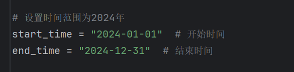

# HunterAPI-modeifed

奇安信的网络空间测绘引擎 [hunter](https://hunter.qianxin.com/) 的 api 查询导出工具

写了一篇关于 [各个网络空间检索平台之间的对比](./introduce.md)


***Modified by Marcar0n1.***

## 使用说明

```shell
git clone github.com/akkuman/HunterApi
cd HunterApi
pip install -r requirements.txt
```


## 截图



这是main文件里面的参数中查找的年限范围

## 修改版的功能
将可以读取txt文件中的ip地址，对批量ip进行查询，如果中途停止会生成一个requested_ip.txt用于保存已经请求过的ip:port，是用于保存进度。

***注意修改APi中Key的值***


